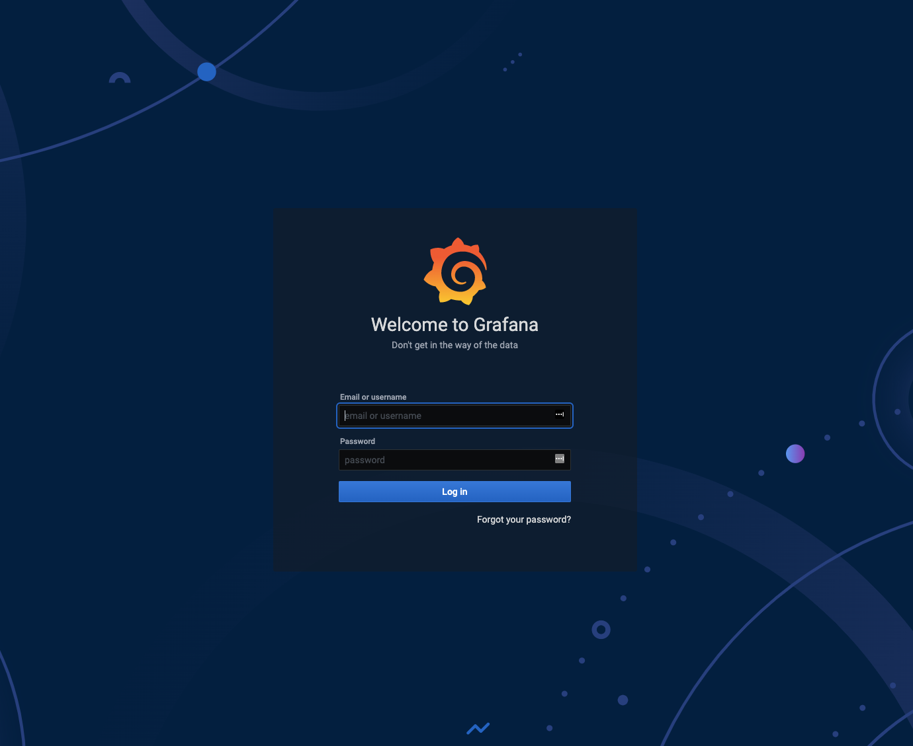
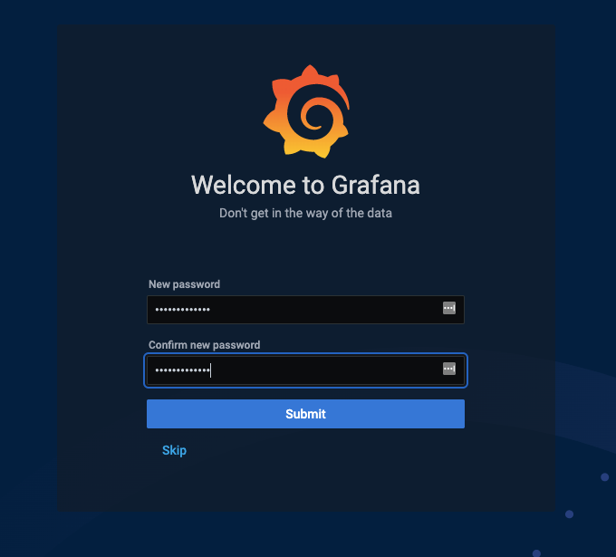
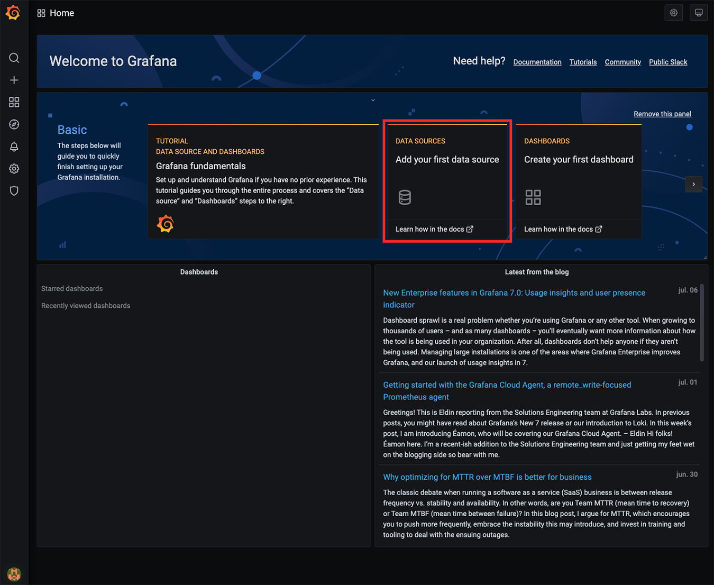

# Adding a Grafana Dashboard to monitor your nodes

### Install grafana

1. Download and install Grafana on your local machine or in your monitoring server: [Grafana](https://grafana.com/grafana/download)

The Grafana backend has a number of configuration options defined in its config file (usually located at /etc/grafana/grafana.ini on linux systems).
Grafana uses port 3000 as default, change it if needed and make sure to configure your firewall accordingly.

Edit grafana.ini For example:

    sudo nano /etc/grafana/grafana.ini

[Grafana configuration options](https://grafana.com/docs/grafana/latest/administration/configuration/)

Start Grafana-server with

    sudo /bin/systemctl start grafana-server

### Configuring your dashboard
2. On your local machine you can now go to  a.b.c.d:3000

You will see this, default user and password are admin/admin.

Change your password

Add your first data source  

{:width="400px"}

Select Prometheus  

Rename it as **prometheus** (IOHK dashboard uses this name, this is useful if you want to import one of our dashboards)

Under HTTP, configure the data source

    URL http://localhost:9090
    Server

Click on `save and test`

On the left panel open the Dashboards menu and go to manage:

You can create a New Dashboard from scratch or import one of IOHK's dashboards. To import a dashboard, click on import

Copy `cardano-application-dashboard-v2.json` from the [cardano-ops repository](chttps://raw.githubusercontent.com/input-output-hk/cardano-ops/ea161f35792e74b41efa749085ead64c901f784d/modules/grafana/cardano/cardano-application-dashboard-v2.json)

and paste the json under `Import via panel json`

